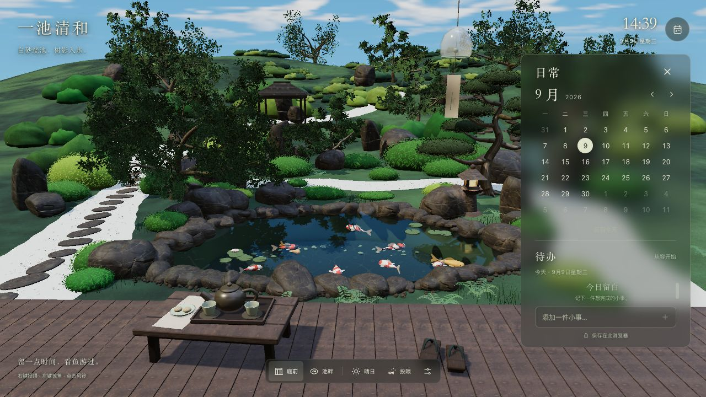

# Zelender · 庭

一方会呼吸的日式锦鲤庭院。坐在木廊里看树影与池水，或俯身看锦鲤游过；把今天的安排，轻轻放在半透明的侧边栏里。

[进入庭院](https://thecyper.github.io/zelender/) · [下载 Chrome 新标签页扩展](https://thecyper.github.io/zelender/zelender-extension.zip) · [源代码](https://github.com/TheCYPER/zelender)



## 在庭院里

| 操作 | 效果 |
| --- | --- |
| 切换庭院 / 俯瞰视角 | 从房间望向日式庭院，或近距离俯视锦鲤池 |
| 右键点击池水 | 鱼食从空中下落，浸湿后缓慢下沉，锦鲤随食物下潜 |
| 左键点击池水 | 激起传播、衰减的水波，让附近锦鲤受惊游开 |
| 拖起茶壶并停在杯上 | 自动倾壶倒茶；松开后回到茶盘 |
| 拖动茶杯 / 右键茶杯 | 调整杯子的位置 / 喝掉杯中茶水 |
| 点击风铃 / C | 轻碰玻璃风铃，让铃体和纸签摆动并发出铃声 |
| 点击喂鱼按钮 | 使用触屏，或用 Tab 聚焦按钮后按 Enter / 空格喂鱼 |
| 切换晴、雨、雪、雾 | 改变光线与天气效果；开启声音后分别切换混合环境声 |
| 选择日历日期 | 查看当天待办，添加、完成或删除事项 |
| 打开右上角日历 | 收起或展开通透的日历与待办侧栏，默认展开 |
| H / 设置中的静观 | 隐藏所有界面；Esc 或角落的小按钮恢复 |

木廊摆有可互动的茶具与木屐，风铃与枝叶随不规则的微风轻摆。锦鲤在不同深度游动，浅水鱼的尾流会带动真实水面起伏。白石小路穿过池塘两侧的修剪灌木和景石，远处有小亭、溪流与高大的树，晴空中浮着白云。雾只在选择雾天时低低掠过庭院，其他天气没有固定远景雾。

在设置中开启「庭院声音」后，晴天的水声与鸟鸣、雨声、雪天的低风和雾天的湿润林间声会平缓切换；切到后台会暂停。

天气是可以自由切换的场景效果，不读取定位或实时天气。时钟与“今天”使用设备的本地时间。

## 设为 Chrome 默认新标签页

网站可以直接访问。要让每个新标签页都打开庭院，需要在桌面版 Chrome 中加载配套扩展；打开网站或下载 ZIP 本身不会完成安装。

1. [下载扩展 ZIP](https://thecyper.github.io/zelender/zelender-extension.zip)，解压到一个准备长期保留的文件夹。
2. 在 Chrome 地址栏输入 `chrome://extensions`。
3. 打开页面右上角的「开发者模式」。
4. 点击「加载已解压的扩展程序」（部分版本显示「加载已解压缩的文件」），选择直接包含 `manifest.json`、`index.html` 和 `assets` 的文件夹。不要选择 ZIP 文件或尚未构建的 `extension` 源目录。
5. 新建一个标签页；如果 Chrome 提示确认新标签页变更，选择保留 Zelender。

最后的加载与确认需要在你自己的 Chrome 中完成。这个项目不执行静默安装，也未发布到 Chrome 应用商店。扩展使用 Manifest V3 的 `chrome_url_overrides.newtab` 加载完整本地应用，不跳转到在线网站；安装后，庭院与待办无需联网即可运行。无痕窗口的新标签页不支持这种替换。安装流程与限制可参阅 [Chrome 官方加载说明](https://developer.chrome.com/docs/extensions/get-started/tutorial/hello-world#load-unpacked) 和 [替换 Chrome 页面文档](https://developer.chrome.com/docs/extensions/develop/ui/override-chrome-pages)。

更新时，将新版本解压到原来的扩展文件夹，再在 `chrome://extensions` 中点击 Zelender 的重新加载按钮。保留原来的路径与扩展身份有助于沿用本地记录。关闭该扩展即可恢复原来的新标签页；卸载前请自行保留需要的待办内容。

## 数据留在本地

待办事项和个人设置存储于当前浏览器的 `localStorage`，没有账号、服务器或云同步。网站和扩展属于不同来源，因此**各自保存一份数据，不会自动互通**；不同浏览器、浏览器资料和设备之间也不会同步。清除相应站点 / 扩展数据可能丢失记录。

扩展不请求浏览记录、标签页、定位或其他额外权限。庭院由 Three.js 渲染，使用本地打包的 Poly Haven CC0 材质与 HDR 光照、连续起伏的庭园地形、EZ-Tree 枝叶模型，以及程序生成的锦鲤、茶具、风铃与天气。扩展运行时不依赖远程脚本、资产或字体。网页版本由 GitHub Pages 提供静态文件。完整来源与许可见 [资产说明](docs/ASSETS.md)。

## 本地开发

需要 Node.js 22.12 或更新的兼容版本，以及 `zip` 命令（macOS 和 Ubuntu 通常已提供）。

```sh
npm ci
npm run dev
```

开发服务器地址以终端输出为准。验证与构建：

```sh
npm run check
npm test
npm run build
npm run preview
```

构建产物：

- `dist/`：可部署的静态网站，包含下载文件 `zelender-extension.zip`。
- `extension-dist/`：可直接在 Chrome 中「加载已解压的扩展程序」的完整目录。

页面需要支持 WebGL 的浏览器与可用的图形加速。应用会限制渲染像素比、在标签页隐藏时暂停动画，并尊重系统的减少动态效果设置。

## 部署

仓库的 GitHub Pages 发布来源设为 **GitHub Actions**。推送到 `main` 后，[部署工作流](.github/workflows/deploy.yml) 依次安装依赖、检查类型、运行测试、构建网站与扩展，然后发布 `dist/`。扩展 ZIP 与网页一同上线，Actions 也保留解压后的扩展构建产物。

Vite 使用相对资源路径 `./`，同一份构建同时适配 GitHub Pages 的 `/zelender/` 子路径与 `chrome-extension://` 来源。

## 许可

[MIT](LICENSE) © 2026 TheCYPER。Three.js 与 EZ-Tree 遵循其自身 MIT 许可；Poly Haven 资产使用 CC0。发布的网页和扩展在 `licenses/` 与 `assets/` 中附带许可、来源和文件校验记录。
